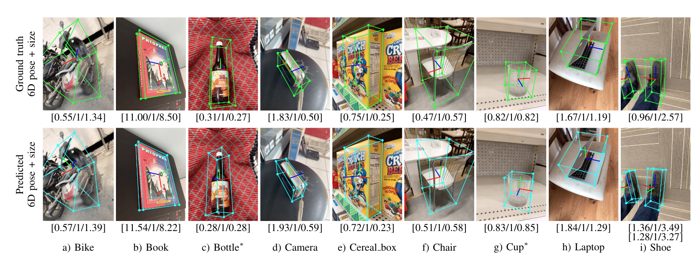

# ROS noetics platform -- category-level object estimation with multiple-detectors 


This repository is the noetic platform implementation of work: [Single-Stage Keypoint-based Category-level Object Pose Estimation from an RGB Image](https://arxiv.org/abs/2109.06161) by Lin et al., ICRA 2022 (full citation below).

The demonstration video is: [liquid manipulation with bottle and cup](https://www.youtube.com/watch?v=oPvfIooH5HU)

Two efforts are made:

- ROS Noetic platform implementation
- Multiple detectors enabled simultanesouly.
- A thresold score system


The pose and dimension will be published as ROS geometry std message StampedPose and Vector3.

These topics are going to be published:
```

self.cup_pose_pub = rospy.Publisher('/pose_cup', PoseStamped, queue_size=1)
self.bottle_pose_pub = rospy.Publisher('/pose_bottle', PoseStamped, queue_size=1)

# object dimension publisher, using Vector3
self.cup_dimension_pub = rospy.Publisher('/dimension_cup',Vector3, queue_size=1)
self.bottle_dimension_pub = rospy.Publisher('/dimension_bottle',Vector3, queue_size=1)

# marker publisher
self.obj_scale_marker_pub = rospy.Publisher('/obj_scale_marker', Marker, queue_size=1)

```

However, due to no reasoning capability, each detector in this work only publish the first object's pose and dimension in the result array, although multiple objects are detected and store in the result array. 

The original camera coordinate convention used in the dataset is  camera frame: +x bottom, +y right, +z back. So i change them to match the realsense camera frame. However, noting i didn't do the orientation coordinate transformation, PoseStamped,pose.orientation will follow the original dataset coordinate.

The most important thing is: The predicted position ( x, y, z) is actually only up to a scale, as we do estimation from a single RGB image. It is not a metric-based result. There should be more effort to generate a real world factor.

For the easier use, I simply measure the real world factor using this: 

real_factor = object_scale_height_given / object_height_measured
result_metrix  =  result_given * real_factor. 


## how to use:

```
roslaunch realsense_camera rs_camera.launch
rosrun CenterPose pose_publish.py
```

# CenterPoseBelow is the original CenterPose work: 



## Overview

This repository is the official implementation of the paper [Single-Stage Keypoint-based Category-level Object Pose Estimation from an RGB Image](https://arxiv.org/abs/2109.06161) by Lin et al., ICRA 2022 (full citation below).  For videos, please visit the [CenterPose project site](https://sites.google.com/view/centerpose). 

In this work, we propose a single-stage, keypoint-based approach for category-level object pose  estimation, which operates on unknown object instances within a known  category using a single RGB image input. The proposed network performs  2D  object detection,  detects 2D  keypoints,  estimates  6-DoF  pose,  and regresses relative 3D bounding cuboid dimensions.  These quantities are estimated in a sequential fashion, leveraging the recent idea of convGRU for propagating information from easier tasks to those that are more difficult.  We favor simplicity in our design choices: generic cuboid vertex coordinates, a single-stage network, and monocular  RGB  input.  We conduct extensive experiments on the challenging Objectron benchmark of real images,  outperforming state-of-the-art methods for 3D IoU metric (27.6% higher than the single-stage approach of MobilePose and 7.1% higher than the related two-stage approach). The algorithm runs at 15 fps on an NVIDIA GTX 1080Ti GPU.

## Tracking option

We also extend CenterPose to the tracking problem (CenterPoseTrack) as described in the paper [Keypoint-Based Category-Level Object Pose Tracking from an RGB Sequence with Uncertainty Estimation](https://arxiv.org/abs/2205.11047) by Lin et al., ICRA 2022 (full citation below). For videos, please visit the [CenterPoseTrack project site](https://sites.google.com/view/centerposetrack). 

We propose a single-stage, category-level 6-DoF pose estimation algorithm that simultaneously detects and tracks instances of objects within a known category. Our method takes as input the previous and current frame from a monocular RGB video, as well as predictions from the previous frame, to predict the bounding cuboid and 6-DoF pose (up to scale). Internally, a deep network predicts distributions over object keypoints (vertices of the bounding cuboid) in image coordinates, after which a novel probabilistic filtering process integrates across estimates before computing the final pose using PnP. Our framework allows the system to take previous uncertainties into consideration when predicting the current frame, resulting in predictions that are more accurate and stable than single frame methods. Extensive experiments show that our method outperforms existing approaches on the challenging Objectron benchmark of annotated object videos. We also demonstrate the usability of our work in an augmented reality setting. The algorithm runs at 10 fps on an NVIDIA GTX 1080Ti GPU.

## Installation

The code was tested on Ubuntu 16.04, with [Anaconda](https://www.anaconda.com/download) Python 3.6 and [PyTorch]((http://pytorch.org/)) 1.1.0. Higher versions should be possible with some accuracy difference. NVIDIA GPUs are needed for both training and testing.

---
***NOTE***

For hardware-accelerated ROS2 inference support, please visit [Isaac ROS CenterPose](https://github.com/NVIDIA-ISAAC-ROS/isaac_ros_pose_estimation/tree/main/isaac_ros_centerpose) which has been tested with ROS2 Foxy on Jetson AGX Xavier/JetPack 4.6 and on x86/Ubuntu 20.04 with RTX3060i.

---

1. Clone this repo:

    ~~~
    CenterPose_ROOT=/path/to/clone/CenterPose
    git clone https://github.com/NVlabs/CenterPose.git $CenterPose_ROOT
    ~~~

2. Create an Anaconda environment or create your own virtual environment
    ~~~
    conda create -n CenterPose python=3.6
    conda activate CenterPose
    pip install -r requirements.txt
    conda install -c conda-forge eigenpy
    ~~~

3. Compile the deformable convolutional layer

    ~~~
    git submodule init
    git submodule update
    cd $CenterPose_ROOT/src/lib/models/networks/DCNv2
    ./make.sh
    ~~~

    [Optional] If you want to use a higher version of PyTorch, you need to download the latest version of [DCNv2](https://github.com/jinfagang/DCNv2_latest.git) and compile the library.
    ~~~
    git submodule set-url https://github.com/jinfagang/DCNv2_latest.git src/lib/models/networks/DCNv2
    git submodule sync
    git submodule update --init --recursive --remote
    cd $CenterPose_ROOT/src/lib/models/networks/DCNv2
    ./make.sh
    ~~~

### How to use higher version of pytorch incoporating with DCN:

I just solved the question by using correct cuda, with corresponding torch, however, the torch has higher version. So i change the DCNv2 to be the latest: https://github.com/lucasjinreal/DCNv2_latest. By

``` 
git clone https://github.com/lucasjinreal/DCNv2_latest.git
```
Then **substitue it with the original DCNv2 folder**. Note here here we go into the folder, and use `$ python3 setup.py build develop` instead of original `./make.sh ` .

```
python3 setup.py build develop
```

After that, i should be fine. You can directly to run demo.py.


4. Download our [CenterPose pre-trained models](https://drive.google.com/drive/folders/16HbCnUlCaPcTg4opHP_wQNPsWouUlVZe?usp=sharing) and move all the `.pth` files to `$CenterPose_ROOT/models/CenterPose/`.  Similarly, download our [CenterPoseTrack pre-trained models](https://drive.google.com/drive/folders/1zOryfHI7ab2Qsyg3rs-zP3ViblknfzGy?usp=sharing) and move all the `.pth` files to `$CenterPose_ROOT/models/CenterPoseTrack/`. We currently provide models for 9 categories: bike, book, bottle, camera, cereal_box, chair, cup, laptop, and shoe. 

5. Prepare training/testing data

    We save all the training/testing data under `$CenterPose_ROOT/data/`.

    For the [Objectron](https://github.com/google-research-datasets/Objectron) dataset, we created our own data pre-processor to extract the data for training/testing. Refer to the [data directory](data/README.md) for more details.

## Demo

We provide supporting demos for image, videos, webcam, and image folders. See `$CenterPose_ROOT/images/CenterPose`

For category-level 6-DoF object estimation on images/video/image folders, run:

```
cd $CenterPose_ROOT/src
python demo.py --demo /home/tianyi/pose_estimation/src/CenterPose/images/CenterPose/cup --arch dlav1_34 --load_model /home/tianyi/pose_estimation/src/CenterPose/models/cup_mug_v1_140.pth
```

Similarly, for category-level 6-DoF object tracking, run:
```
cd $CenterPose_ROOT/src
python demo.py --demo /path/to/folder/or/video --arch dla_34 --load_model ../path/to/model --tracking_task
```

You can also enable `--debug 2` to display more intermediate outputs or `--debug 4` to save all the intermediate and final outputs.

For the webcam demo (You may want to specify the camera intrinsics via --cam_intrinsic), run:
```
cd $CenterPose_ROOT/src
python demo.py --demo webcam --arch dlav1_34 --load_model /home/tianyi/pose_estimation/src/CenterPose/models/cup_mug_v1_140.pth

python realsense.py --demo webcam --arch dlav1_34 --load_model /home/tianyi/pose_estimation/src/CenterPose/models/cup_mug_v1_140.pth
```

Similarly, for tracking, run:
```
cd $CenterPose_ROOT/src
python demo.py --demo webcam --arch dla_34 --load_model ../path/to/model --tracking_task
```

## Training

We follow the approach of [CenterNet](https://github.com/xingyizhou/CenterNet/blob/master/experiments/ctdet_coco_dla_1x.sh) for training the DLA network, reducing the learning rate by 10x after epoch 90 and 120, and stopping after 140 epochs. Similarly, for CenterPoseTrack, we train the DLA network, reducing the learning rate by 10x after epoch 6 and 10, and stopping after 15 epochs.

For debug purposes, you can put all the local training params in the `$CenterPose_ROOT/src/main_CenterPose.py` script. Similarly, CenterPoseTrack can follow `$CenterPose_ROOT/src/main_CenterPoseTrack.py` script. You can also use the command line instead. More options are in `$CenterPose_ROOT/src/lib/opts.py`.

To start a new training job, simply do the following, which will use default parameter settings:
```
cd $CenterPose_ROOT/src
python main_CenterPose.py
```

The result will be saved in `$CenterPose_ROOT/exp/object_pose/$dataset_$category_$arch_$time` ,e.g., `objectron_bike_dlav1_34_2021-02-27-15-33`

You could then use tensorboard to visualize the training process via
```
cd $path/to/folder
tensorboard --logdir=logs --host=XX.XX.XX.XX
```

/// 我的realsense的内参
---
header: 
  seq: 39
  stamp: 
    secs: 1732242774
    nsecs: 566140652
  frame_id: "camera_color_optical_frame"
height: 480
width: 640
distortion_model: "plumb_bob"
D: [0.0, 0.0, 0.0, 0.0, 0.0]
K: [615.0198364257812, 0.0, 317.4881591796875, 0.0, 615.1835327148438, 244.118896484375, 0.0, 0.0, 1.0]
R: [1.0, 0.0, 0.0, 0.0, 1.0, 0.0, 0.0, 0.0, 1.0]
P: [615.0198364257812, 0.0, 317.4881591796875, 0.0, 0.0, 615.1835327148438, 244.118896484375, 0.0, 0.0, 0.0, 1.0, 0.0]
binning_x: 0
binning_y: 0
roi: 
  x_offset: 0
  y_offset: 0
  height: 0
  width: 0
  do_rectify: False
---
